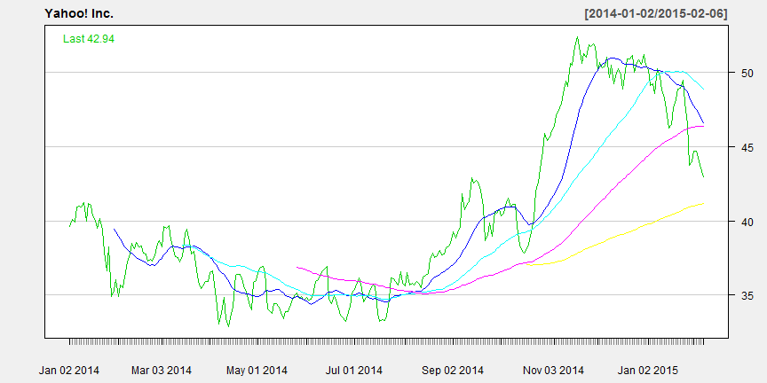

Stock Moving Average Application
========================================================
author: Amos Ang
date: 08 February 2015

Application Overview
========================================================

- This application takes in a stock symbol and a date range. 
- It retrieves the daily prices from Yahoo Finance, and plots a chart of the adjusted closing prices. 
- The checkboxes allow you to calculate the moving averages of the price, and overlay them on the price chart. This can potentially help you to identify stocks which are possibly undervalued. 
- This application relies extensively on the [quantmod package](http://www.quantmod.com/).
- This application is done as part of the **Developing Data Products** course on Coursera.

Application Value Proposition
========================================================

The main value proposition of this application is that it helps you make better investing decisions, by allowing you to visually see if a stock is under-valued. A rule of thumb is that if the moving average is trending upwards (eg: 200 DMA), and the stock price falls below this moving average, it could signal that the stock has been oversold, and may be worth looking at.  

The main value proposition above is supported by the following features:

1. Ability to tap into Yahoo's extensive database of historical prices, for a vast number of stocks, across multiple stock exchanges.
 
2. Ability to zoom in on a specific date range.
 
3. Ability to calculate 20/50/100/200-day moving averages, and have the averages overlaid onto the main price chart. 
 
4. No installation of any software needed. Runs from your browser.

Location of Shinyapp and GitHub Repository
========================================================

- Shinyapp: [https://amosang.shinyapps.io/Project/](https://amosang.shinyapps.io/Project/)

- GitHub Repo: [https://github.com/amosang21/coursera-devdataprod](https://github.com/amosang21/coursera-devdataprod)

Example: Chart for YAHOO (YHOO)
========================================================

The R code is executed and the prices retrieved from Yahoo.  
The code has been suppressed, but the output chart is shown below, with the 4 moving averages plotted.

 
